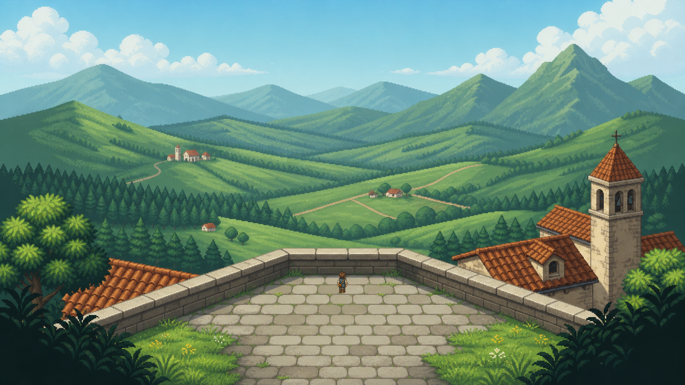

# Video-to-Playable Appennino RPG Lab

An open, evidence-first investigation into an AI-native workflow for turning a
short video of an Italian Appennino hill town into a beautiful playable 2D/2.5D
RPG location.

This repository keeps the successes, failed experiments, misleading metrics,
and corrective tests. The aim is not to publish a polished victory narrative;
it is to discover which parts of the workflow are genuinely reusable.

## Current result

We now have **two connected playable micro-nodes**. An animated traveler can
cross the accepted lower fountain court, use a tested east-side travel point,
explore a source-video-inspired belvedere, and return to the piazza. The first
node retains its tested fountain collision and local planter occlusion.



See [Experiment F](experiment-f-connected-belvedere/README.md) for controls,
generation provenance, reproduction commands, machine-readable round-trip
tests, four deliberate failure mutations, real-render evidence, and the honest
scalability assessment.

The separate [Moonroot Hollow experiment](experiment-g-moonroot-hollow/README.md)
tests transfer to a new fantastical RPG with full creative freedom. One
generated raster town now supports a complete talk → collect → deliver quest
with no SVG or procedural primitive artwork.

## Experiment timeline

| Stage | Question | Honest result |
| --- | --- | --- |
| Procedural Blender | Can deterministic 3D guarantee scale, camera, and reusable geometry? | **Structural success, aesthetic limitation.** Geometry is coherent; the render lacks the desired authored charm. |
| Independent 2D assets | Can beautiful generated buildings/props be assembled into a map? | **Asset-level beauty, scene-level failure.** Mixed cameras and scale create the “asset collage” problem. |
| Historical Experiment B | Did whole-scene generation, decomposition, and Godot validation solve both? | **Invalid experiment.** The scene was nearly blank, later candidates were Pillow filters, scores were hard-coded, PSNR was tautological, and tests self-certified. Files remain as failure evidence. |
| [Experiment C](experiment-c-neural-repaint/RESULTS.md) | Can a neural model repaint a deterministic scene while preserving gameplay geometry? | **Aesthetic pass, spatial-control fail.** Coarse topology survives, but 72–112 px landmark drift makes source masks unsafe. |
| [Experiment D](experiment-d-art-first-node/RESULTS.md) | Can final generated art become a small playable node if new geometry is authored against it? | **Pass in a narrow scope.** Six real assertions pass; two deliberate corruptions are rejected. |
| [Experiment E](experiment-e-character-occlusion/RESULTS.md) | Can the same node gain animated embodiment and one honest depth interaction? | **Local causal pass, visual-integration partial.** Twelve runtime checks, seven mutations, and real-render pixel comparison pass; the traveler remains slightly underscaled/flatter than baked figures. |
| [Experiment F](experiment-f-connected-belvedere/RESULTS.md) | Can the art-first workflow transfer to a connected second video-inspired node? | **First transfer pass, automation unproven.** One-call belvedere art, round-trip portals, eight checks, four mutations, and real-render verification pass; geometry and visual review remain manual. |
| [Moonroot Hollow / Experiment G](experiment-g-moonroot-hollow/RESULTS.md) | Do the findings transfer to a new fantastical RPG optimized for completeness and time? | **Lean complete pass.** One generation, zero pixel repairs, one screen, a complete three-stage quest, seven checks, four mutations, and raster-only verification. Godot remains the lowest-resistance runtime. |

## Reproduce the playable slice

Requirements: Godot 4.7.2 and Python with Pillow.

```powershell
powershell -ExecutionPolicy Bypass -File experiment-f-connected-belvedere/scripts/run_validation.ps1
godot --path experiment-f-connected-belvedere --scene res://scenes/main.tscn
```

Controls: arrows or WASD to move, `E` to travel at a gold marker, `F2` to show
the authored geometry, and `Esc` to quit.

## Evidence policy

- Untouched generated images retain hashes, prompts, timestamps, dimensions,
  input paths, and whatever generator metadata was actually exposed.
- Beauty and spatial fidelity are evaluated separately.
- A generator never grades its own output.
- A screenshot, video, timeout, or process exit code is not a passing test.
- Runtime assertions record expected and actual values.
- Mutation tests must demonstrate that critical checks reject known-bad state.
- Failed experiments remain visible and are never relabeled after seeing their
  results.

The transferable lessons and anti-patterns are collected in
[FINDINGS.md](FINDINGS.md).

## Repository map

```text
experiment-c-neural-repaint/   Controlled OpenAI whole-scene comparison
experiment-d-art-first-node/   First honest Godot playable micro-node
experiment-e-character-occlusion/ Animated traveler + one tested depth layer
experiment-f-connected-belvedere/ Connected piazza ↔ belvedere transfer test
experiment-g-moonroot-hollow/   From-scratch fantastical town + complete quest
whole-scene-experiment/        Preserved invalid Experiment B evidence
appennino-2d-asset-factory/    Independent 2D asset experiments
output/                        Procedural Blender outputs
reference_frames/              Frames extracted from the reference video
FINDINGS.md                    Cross-experiment lessons and decision record
```

## Current architecture decision

Whole-frame neural generation is excellent for authored atmosphere but is not
yet reliable enough to preserve pre-existing gameplay masks. Two honest paths
remain:

1. geometry-first production with neural texture/detail/backdrop assistance;
2. art-first scene generation followed by new gameplay geometry authored or
   extracted against the final pixels.

Experiments D–E validate the second path for one fountain court, animated
embodiment, and one mutation-sensitive foreground layer. Experiment F reuses
those contracts for a connected belvedere and is the first evidence of
cross-node transfer. It also shows the current bottleneck clearly: content
generation transferred quickly, while frame selection, geometry authorship,
visual review, and research-grade validation remain manual. The next ordinary
nodes should reuse the frozen harness and measure repair/manual effort instead
of rebuilding an elaborate bespoke proof each time.
