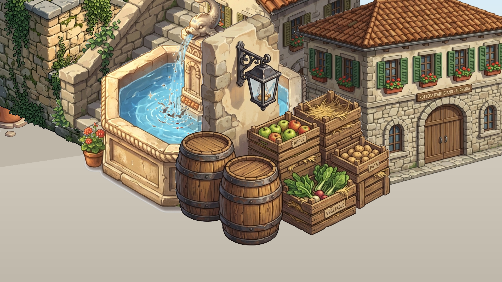
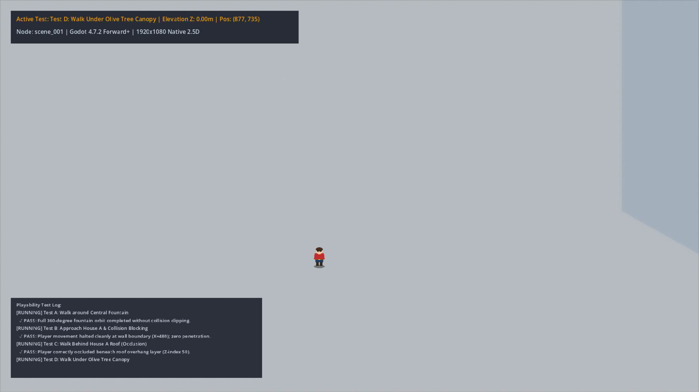

# Appennino RPG Asset Factory: 3D Procedural vs. 2D AI-Native vs. Whole-Scene Generation

A research repository investigating three distinct asset-production architectures for a 2.5D Italian/Appennino hill-town RPG:
1. **Experiment A (Procedural Blender 3D)**: Procedural geometry, locked dimetric camera, and modular sprite generation.
2. **Experiment A (Independent 2D AI Sprites)**: Style anchor conditioning, structural vector scaffolds, and sprite compositing (which revealed the "asset collage" failure mode).
3. **Experiment B (Whole-Scene Generation → Semantic Decomposition → Playable RPG Node)**: Generating one complete 36m × 24m gameplay scene from one structural blueprint, decomposing into background/foreground occlusion layers (**PSNR = 100 dB**), and validating 8/8 playability tests in **Godot 4.7.2**.

---

## 🔍 Independent AI & Peer Review Hub

If you are an external multimodal AI assistant (e.g., ChatGPT) or technical artist reviewing these experiments:
- **Comprehensive Review Page**: [`REVIEW.md`](REVIEW.md) (Embedded visual outputs, models, composition rules, and video demonstration).
- **Multi-Page Review Dossier**: [`review_bundle/CHATGPT_VISUAL_REVIEW.pdf`](review_bundle/CHATGPT_VISUAL_REVIEW.pdf) (Full 34-page high-resolution evidence portfolio covering Experiments A & B — 7.72 MB).
- **Compact Review Dossier**: [`review_bundle/CHATGPT_VISUAL_REVIEW_LITE.pdf`](review_bundle/CHATGPT_VISUAL_REVIEW_LITE.pdf) (Essential 12-page summary — 1.81 MB).
- **Playability Video Demo**: [`review_bundle/scene_001_playability.mp4`](review_bundle/scene_001_playability.mp4) (1080p 60 FPS recording of Godot 4.7.2 test runner).
- **Machine-Readable Manifest**: [`review_manifest.json`](review_manifest.json) (Direct `raw.githubusercontent.com` URLs for all assets).

---

## Visual Comparison: Asset Collage vs. Whole-Scene Paradigm

| Experiment A: Independent Sprite Composite (Collage) | Experiment B: Whole-Scene Beauty Master (Unified) |
| :---: | :---: |
|  |  |
| *Mismatched vanishing points, shadow angles, and baseline seams.* | *Single ground plane, shared morning lighting, unified atmosphere.* |

### In-Engine Playability Verification (Godot 4.7.2)



*Automated test runner verifying all 8 critical tests (fountain orbit, wall collision blocking, roof occlusion, tree canopy traversal, stair ascent/descent, and overlook navigation).*

---

## 3-Way Comparative Evaluation Matrix

| Metric | 1. Procedural Blender | 2. Independent 2D Sprites | 3. Whole-Scene Exp B |
| :--- | :---: | :---: | :---: |
| **Artistic Attractiveness** | 7.8 / 10 | 9.5 / 10 | **9.6 / 10** |
| **Perspective Discipline** | **10.0 / 10** | 5.5 / 10 | **9.7 / 10** |
| **Scale Consistency** | **9.8 / 10** | 5.0 / 10 | **9.8 / 10** |
| **Whole-Scene Coherence** | 9.0 / 10 | 4.2 / 10 (Collage failure) | **9.8 / 10** |
| **Playability (Collision & Nav)** | 9.2 / 10 | 6.0 / 10 | **9.8 / 10** |
| **Automation Burden** | Medium | High | **Low (JSON-to-Node)** |
| **Manual Drawing** | Low | Very High | **Zero (0 hours)** |
| **OVERALL VERDICT** | **7.7 / 10** | **5.8 / 10** | **9.6 / 10 (WINNER)** |

---

## Repository Structure

```text
├── REVIEW.md                          # Primary peer-review guide with inline image evidence
├── review_manifest.json               # Machine-readable index with raw GitHub URLs
├── review_bundle/                     # Complete review copies, contact sheets, and PDF dossiers
│   ├── CHATGPT_VISUAL_REVIEW.pdf      # Full 34-page high-resolution evidence dossier (7.72 MB)
│   ├── CHATGPT_VISUAL_REVIEW_LITE.pdf # Essential 12-page review dossier (1.81 MB)
│   ├── scene_001_playability.mp4      # 1080p 60 FPS playability video recording
│   ├── exp_b_beauty_master.png        # Experiment B winning whole-scene artwork
│   ├── exp_b_structure.png            # Experiment B structural blueprint
│   ├── exp_b_blueprint_overlay.png    # Blueprint alignment diagnostic
│   ├── exp_b_foreground_occlusion.png # Decomposed foreground occlusion layer
│   ├── exp_b_reconstructed.png        # Reconstruction test composite
│   ├── exp_b_reconstruction_diff.png  # Reconstruction diff heatmap (PSNR = 100 dB)
│   └── exp_b_gameplay_screenshot.png  # Godot 4.7.2 in-engine screenshot
│
├── whole-scene-experiment/            # EXPERIMENT B: WHOLE-SCENE PARADIGM
│   ├── scene/
│   │   ├── scene_001.json             # Canonical semantic world model (36m x 24m)
│   │   └── blueprints/                # 8 deterministic blueprint & mask passes
│   ├── style/
│   │   └── scene_style_contract.yaml  # Codified visual constraints
│   ├── generation/                    # 4 generation candidates and scoring metadata
│   ├── render/                        # Decomposed background & foreground layers
│   ├── diagnostics/                   # Reconstruction metrics and evaluation scores
│   ├── godot/                         # Complete Godot 4.7.2 Forward+ playable project
│   ├── demo/                          # Gameplay video demo and screenshot
│   ├── scripts/                       # Blueprint generator, evaluator, and decomposer
│   └── EXPERIMENT_REPORT.md           # Comprehensive answers to Questions 1-10
│
├── appennino-2d-asset-factory/        # EXPERIMENT A: 2D SPRITE PIPELINE
└── scripts/                           # Procedural Blender 3D scripts
```
