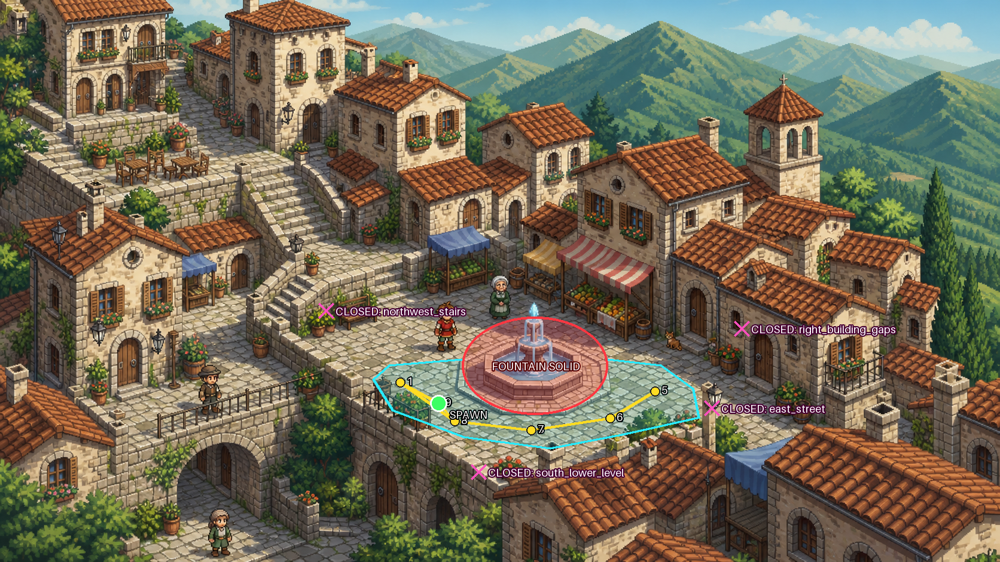

# Video-to-Playable Appennino RPG Lab

An open, evidence-first investigation into an AI-native workflow for turning a
short video of an Italian Appennino hill town into a beautiful playable 2D/2.5D
RPG location.

This repository keeps the successes, failed experiments, misleading metrics,
and corrective tests. The aim is not to publish a polished victory narrative;
it is to discover which parts of the workflow are genuinely reusable.

## Current result

We now have a **small but real playable node**: a controllable player can walk
through the lower half of a neural-generated fountain court, collide with the
visible basin and plaza boundary, and complete a tested west–south–east route
and return.



See [Experiment D](experiment-d-art-first-node/README.md) for controls,
reproduction commands, machine-readable tests, deliberate failure mutations,
and strict nonclaims.

## Experiment timeline

| Stage | Question | Honest result |
| --- | --- | --- |
| Procedural Blender | Can deterministic 3D guarantee scale, camera, and reusable geometry? | **Structural success, aesthetic limitation.** Geometry is coherent; the render lacks the desired authored charm. |
| Independent 2D assets | Can beautiful generated buildings/props be assembled into a map? | **Asset-level beauty, scene-level failure.** Mixed cameras and scale create the “asset collage” problem. |
| Historical Experiment B | Did whole-scene generation, decomposition, and Godot validation solve both? | **Invalid experiment.** The scene was nearly blank, later candidates were Pillow filters, scores were hard-coded, PSNR was tautological, and tests self-certified. Files remain as failure evidence. |
| [Experiment C](experiment-c-neural-repaint/RESULTS.md) | Can a neural model repaint a deterministic scene while preserving gameplay geometry? | **Aesthetic pass, spatial-control fail.** Coarse topology survives, but 72–112 px landmark drift makes source masks unsafe. |
| [Experiment D](experiment-d-art-first-node/RESULTS.md) | Can final generated art become a small playable node if new geometry is authored against it? | **Pass in a narrow scope.** Six real assertions pass; two deliberate corruptions are rejected. |

## Reproduce the playable slice

Requirements: Godot 4.7.2 and Python with Pillow.

```powershell
powershell -ExecutionPolicy Bypass -File experiment-d-art-first-node/scripts/run_validation.ps1
godot --path experiment-d-art-first-node --scene res://scenes/main.tscn
```

Controls: arrows or WASD to move, `F2` to show the authored geometry, and
`Esc` to quit.

## Evidence policy

- Untouched generated images retain hashes, prompts, timestamps, dimensions,
  input paths, and whatever generator metadata was actually exposed.
- Beauty and spatial fidelity are evaluated separately.
- A generator never grades its own output.
- A screenshot, video, timeout, or process exit code is not a passing test.
- Runtime assertions record expected and actual values.
- Mutation tests must demonstrate that critical checks reject known-bad state.
- Failed experiments remain visible and are never relabeled after seeing their
  results.

The transferable lessons and anti-patterns are collected in
[FINDINGS.md](FINDINGS.md).

## Repository map

```text
experiment-c-neural-repaint/   Controlled OpenAI whole-scene comparison
experiment-d-art-first-node/   Current Godot playable micro-node
whole-scene-experiment/        Preserved invalid Experiment B evidence
appennino-2d-asset-factory/    Independent 2D asset experiments
output/                        Procedural Blender outputs
reference_frames/              Frames extracted from the reference video
FINDINGS.md                    Cross-experiment lessons and decision record
```

## Current architecture decision

Whole-frame neural generation is excellent for authored atmosphere but is not
yet reliable enough to preserve pre-existing gameplay masks. Two honest paths
remain:

1. geometry-first production with neural texture/detail/backdrop assistance;
2. art-first scene generation followed by new gameplay geometry authored or
   extracted against the final pixels.

Experiment D validates the second path for one small fountain court. The next
step is to add a style-matched player and one tested foreground occluder before
opening a second zone.
