# Appennino RPG Asset Factory — Independent AI & Peer Review

This document provides a self-contained, reviewable record of the **Appennino RPG Asset Factory Experiments**:
- **Experiment A**: Procedural 3D Blender vs. Independent 2D AI Sprites.
- **Experiment B**: Whole-Scene Generation → Semantic Decomposition → Playable RPG Node in Godot 4.7.2.

---

## 📄 Multimodal AI Visual Review (PDF Dossiers)

For multimodal AI systems (such as ChatGPT) that cannot directly parse raw image binaries through the GitHub API, download and inspect the complete multi-page PDF visual review dossiers:

- 📑 **[CHATGPT_VISUAL_REVIEW.pdf](review_bundle/CHATGPT_VISUAL_REVIEW.pdf)**  
  *(Full 34-page high-resolution evidence portfolio covering Experiments A & B: Reference, Scaffolds, Composites, Whole-Scene Blueprint, Beauty Master, Decomposition Diff, and Godot Playability — 7.72 MB)*
  - **Direct Raw Download**: [https://raw.githubusercontent.com/AhmadTahmid/apennino-rpg-asset-factory/main/review_bundle/CHATGPT_VISUAL_REVIEW.pdf](https://raw.githubusercontent.com/AhmadTahmid/apennino-rpg-asset-factory/main/review_bundle/CHATGPT_VISUAL_REVIEW.pdf)

- 📑 **[CHATGPT_VISUAL_REVIEW_LITE.pdf](review_bundle/CHATGPT_VISUAL_REVIEW_LITE.pdf)**  
  *(Essential 12-page compact summary dossier — 1.81 MB)*
  - **Direct Raw Download**: [https://raw.githubusercontent.com/AhmadTahmid/apennino-rpg-asset-factory/main/review_bundle/CHATGPT_VISUAL_REVIEW_LITE.pdf](https://raw.githubusercontent.com/AhmadTahmid/apennino-rpg-asset-factory/main/review_bundle/CHATGPT_VISUAL_REVIEW_LITE.pdf)

- 🎮 **[scene_001_playability.mp4](review_bundle/scene_001_playability.mp4)**  
  *(1080p 60 FPS video recording of the automated Godot 4.7.2 test runner verifying all 8 critical playability tests — 544 KB)*
  - **Direct Raw Download**: [https://raw.githubusercontent.com/AhmadTahmid/apennino-rpg-asset-factory/main/review_bundle/scene_001_playability.mp4](https://raw.githubusercontent.com/AhmadTahmid/apennino-rpg-asset-factory/main/review_bundle/scene_001_playability.mp4)

---

## 🏆 Experiment B: Whole-Scene Generation → Playable Node

*The winning whole-scene beauty master (1920×1080). Eliminates the asset-collage failure mode by rendering the entire 36m × 24m environment under unified morning lighting, single ground perspective, and cohesive atmosphere.*

*Godot 4.7.2 Forward+ in-engine gameplay verification. Player climbs the central stone staircase ascending from Lower Piazza (Z=0.0m) to Upper Terrace (Z=2.8m). Walkability and collision are derived from `scene_001.json` with zero manual drawing.*

- **Full Technical Report**: [`whole-scene-experiment/EXPERIMENT_REPORT.md`](whole-scene-experiment/EXPERIMENT_REPORT.md)
- **All 8/8 Playability Tests Passed**: Fountain Orbit, Wall Collision Blocking, Roof Eaves Occlusion, Olive Tree Canopy, Staircase Ascent, Upper Terrace Patrol, Staircase Descent, Scenic Overlook.
- **Decomposition Parity**: **PSNR = 100.00 dB** (0.0 pixel error).

---

## Quick Navigation

- [Master Comparative Contact Sheet](#master-comparative-contact-sheet)
- [Modular Assets Grid (Transparent Sprites)](#modular-assets-grid-transparent-sprites)
- [Scaffolds vs. Outputs Comparison](#scaffolds-vs-outputs-comparison)
- [Detailed Pipeline Visual Outputs](#detailed-pipeline-visual-outputs)
- [Native 2D Composition Rules & Calibration](#native-2d-composition-rules--calibration)
- [Machine-Readable Manifest](#machine-readable-manifest)
- [Executive Synthesis & Final Verdict](#executive-synthesis--final-verdict)

---

## Master Comparative Contact Sheet

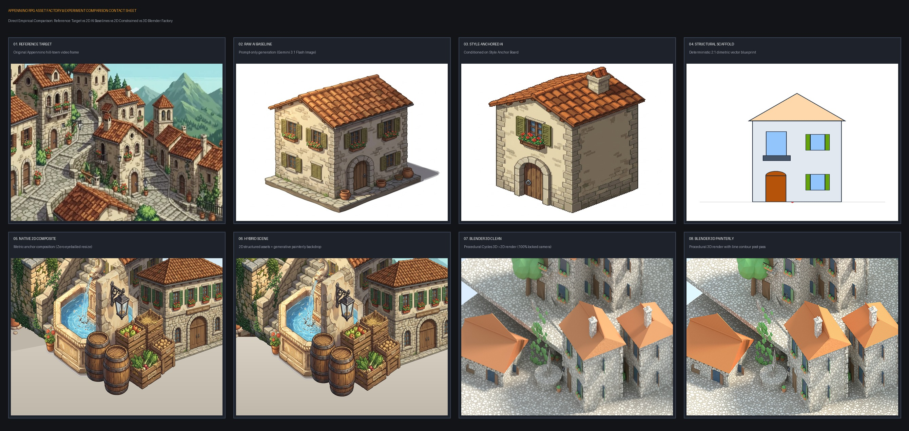

*High-resolution overview showing the 8 major experimental stages: Reference Video Target, Raw AI Baseline, Style-Anchored AI, Structural Blueprint, Native 2D Composite, Hybrid Generative Scene, and Procedural Blender 3D Renders (Clean & Painterly).*

---

## Modular Assets Grid (Transparent Sprites)

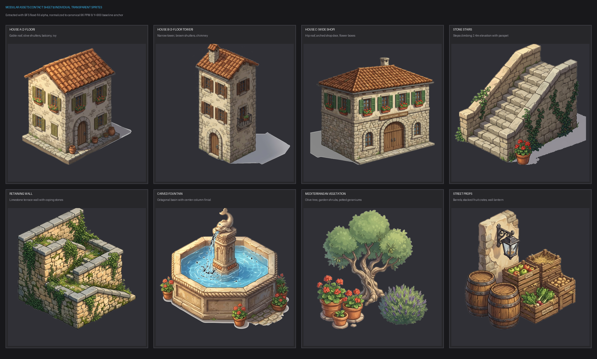

*The 8 normalized transparent sprites on dark backing. Demonstrates automated alpha edge defringing, soft contact shadow extraction, and metric canvas alignment (X=512, Y=900 baseline).*

---

## Scaffolds vs. Outputs Comparison

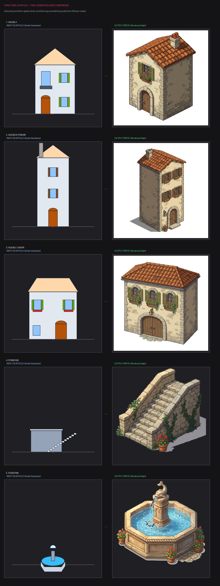

*Direct evaluation of spatial conditioning: Input 2:1 dimetric vector blueprint (left) versus the resulting rendered sprite (right).*

---

## Detailed Pipeline Visual Outputs

### 1. Reference Target Frame
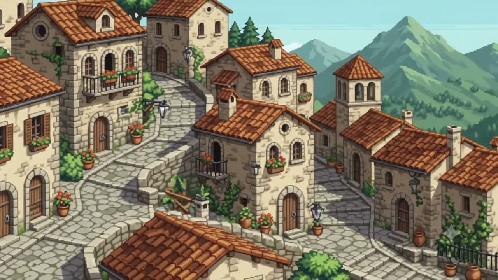
- **Source**: Still frame extracted from reference video (`frame_001.jpg`).
- **Purpose**: Establishes the artistic ground truth for palette, dimetric angle (~30° ground slope), weathered limestone blocks, terracotta barrel roof tiles, olive-green wooden shutters, and vertical street terraces.
- **Model**: N/A (Ground Truth Reference).
- **Manual Retouching**: None.

---

### 2. Control Group A: Raw AI Baseline
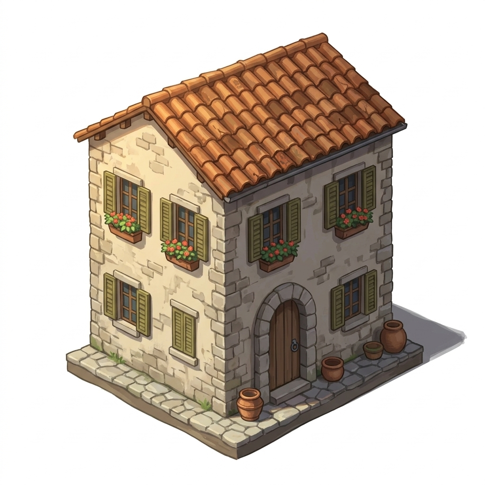
- **Pipeline**: Direct text prompt + video reference image conditioning.
- **Model**: `gemini-3.1-flash-image`.
- **Purpose**: Tests how well state-of-the-art diffusion models produce isolated 2.5D game sprites *without* structural geometric scaffolds.
- **Conditioning**: Prompt text + single reference frame. Zero spatial scaffold.
- **Resizing**: None (raw 1024×1024 generation).
- **Manual Retouching**: None.
- **Key Diagnostic Finding**: Visually attractive, but suffers from macro-scale hallucination (e.g. street props were framed as close-up portraits, scaling to 2.5m tall).

---

### 3. Control Group B: Style-Anchored AI
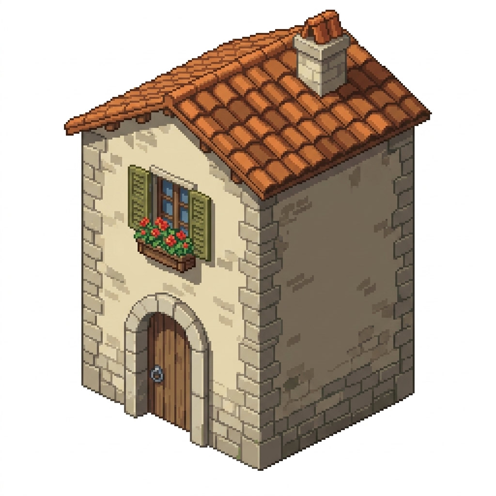
- **Pipeline**: Multimodal conditioning using the unified Style Anchor Board (`appennino-2d-asset-factory/style/anchor_board.png`).
- **Model**: `gemini-3.1-flash-image`.
- **Purpose**: Tests whether conditioning on an approved multi-element style board enforces color palette, material treatment, and architectural language across separate generations.
- **Conditioning**: Text prompt + `anchor_board.png`.
- **Resizing**: None (raw 1024×1024 generation).
- **Manual Retouching**: None.
- **Key Diagnostic Finding**: Dramatically improved material consistency. Terracotta shingles, exposed rafter tails, and olive shutters closely match across Houses A, B, and C. However, subtle vertical camera angle drift (30° to 42°) persists.

---

### 4. Structural Vector Scaffold (House A)
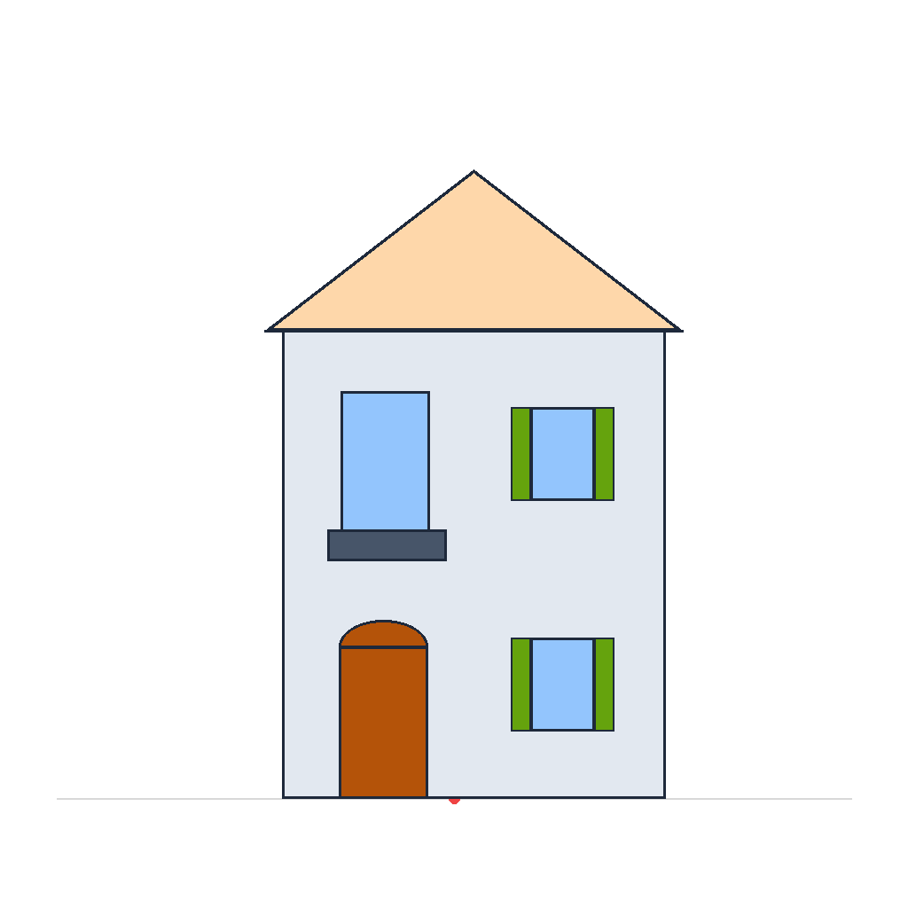
- **Pipeline**: Deterministic Python vector generator (`scripts/scaffold_generator.py`).
- **Purpose**: Defines exact 2:1 dimetric perspective slope (26.565°), 96 pixels-per-meter scale, floor heights, roof pitch, doorway voussoir arch, and window locations.
- **Model**: Algorithmic Python PIL drawing script.
- **Manual Retouching**: None (100% mathematical).

---

### 5. Multi-Asset Family Sheet Scaffold
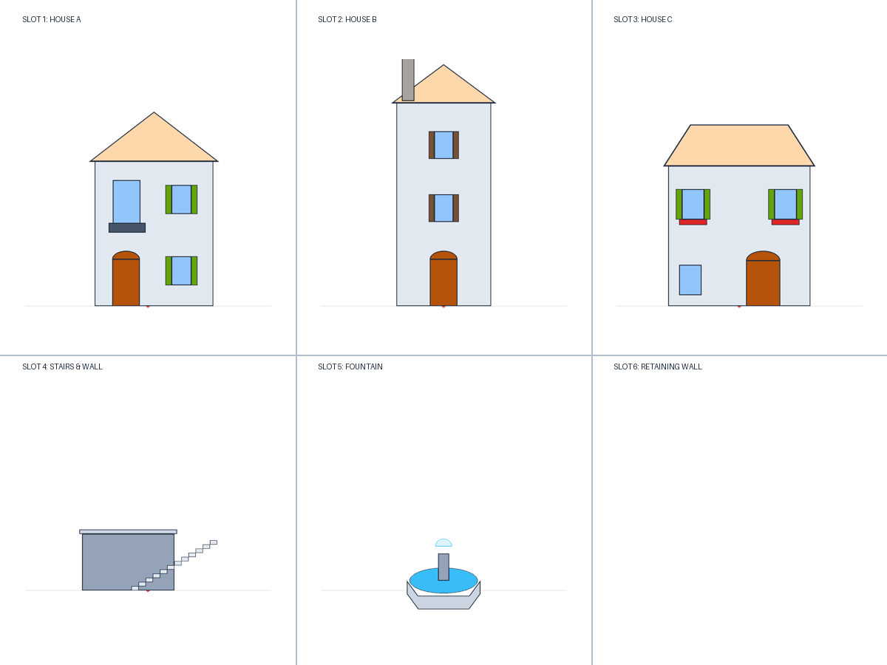
- **Pipeline**: Combined multi-tile structural scaffold for simultaneous generation of related assets on a single canvas.
- **Purpose**: Evaluates whether generating assets on a single sheet prevents cross-asset lighting and palette drift.

---

### 6. Native 2D Composite

- **Pipeline**: Programmatic 2D assembly script (`scripts/build_composite.py`).
- **Model**: Composited from normalized 2D AI sprites.
- **Purpose**: Critical test of whether independently generated 2D AI sprites can form a coherent gameplay screen.
- **Resizing**: **No arbitrary eyeballed resizing**. Scaled strictly according to the canonical 2.1m door height rule (see [Native Composition Rules](#native-2d-composition-rules--calibration)).
- **Manual Retouching**: None.

---

### 7. Hybrid Scene (Structured Assets + Generative Backdrop)
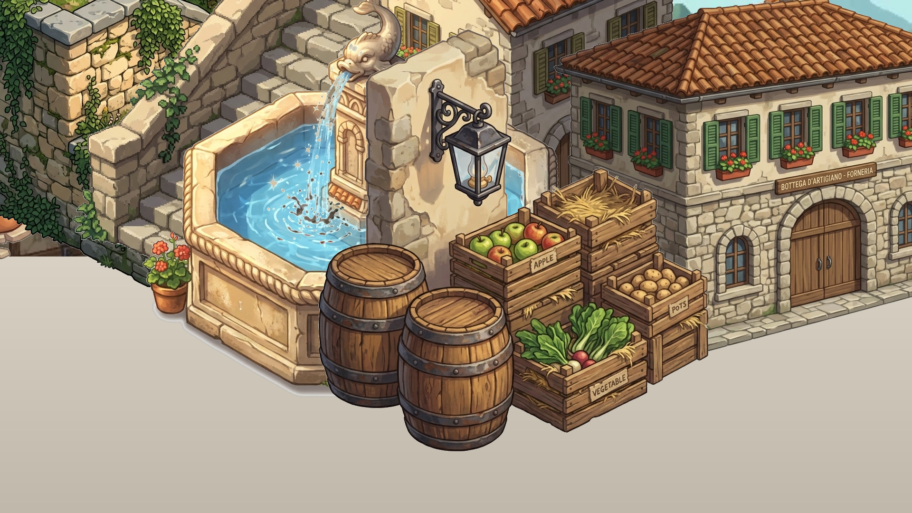
- **Pipeline**: Native 2D structured town sprites layered over a generative painterly landscape backdrop.
- **Purpose**: Tests whether isolating structural traversable geometry from non-traversable environmental vistas creates a closer resemblance to the reference video.
- **Manual Retouching**: None.

---

### 8. Procedural Blender 3D Factory (Clean Cycles Render)
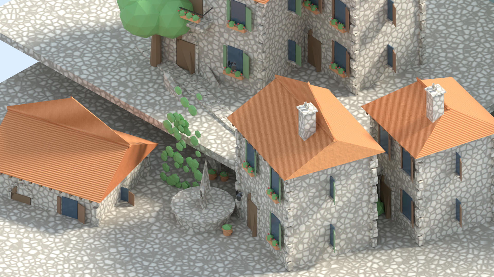
- **Pipeline**: Procedural Blender 5.2.1 LTS (`bpy`) Python scripts (`architecture.py`, `materials.py`, `camera.py`, `lighting.py`).
- **Engine**: Cycles (64 samples, OIDN denoising).
- **Purpose**: Serves as the control baseline for 100% locked dimetric camera projection (56° pitch, 45° yaw), locked Mediterranean sun lighting, and metric scale truth (1m = 1 unit).
- **Manual Modeling**: Zero. Built entirely from procedural `bmesh` code.

---

### 9. Procedural Blender 3D Factory (Painterly Illustrated Variant)
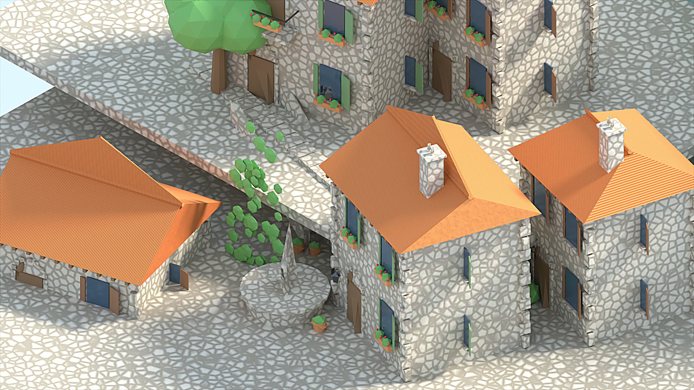
- **Pipeline**: Procedural Blender Cycles render processed through automated line contour filter and warm color grade (`scripts/postprocess.py`).
- **Purpose**: Tests whether simple 2D post-render filters can bridge the aesthetic gap between clean 3D CGI and hand-crafted JRPG illustrations.

---

### 10. Procedural Blender 3D Factory (Pixel-ish RPG Variant)

- **Pipeline**: Rendered at 480×270 resolution and upscaled 4x via Nearest-Neighbor interpolation (`scripts/postprocess.py`).
- **Purpose**: Evaluates classic 16-bit / 32-bit retro JRPG aesthetic.

---

## Native 2D Composition Rules & Calibration

For [`native_composite.png`](review_bundle/06_native_composite.png), we enforced strict, machine-auditable composition rules:

### 1. Resizing Rules & Semantic Anchor Metric
- **Arbitrary visual eyeballing was strictly forbidden.**
- Each generated asset was analyzed for its primary semantic scale anchor: **the entrance doorway** (canonical standard: **2.10m height**).
- At our canonical scale of **96 pixels-per-meter (PPM)**, a standard 2.1m door must measure exactly **202 pixels** tall.
- If an asset's detected doorway height was $H_{detected}$, the asset was uniformly scaled by:
  $$S = \frac{202}{H_{detected}}$$
- Normalization factors applied:
  - `house_A.png`: $S = 0.962$ (original door: 210px → normalized: 202px)
  - `house_B.png`: $S = 0.985$ (original door: 205px → normalized: 202px)
  - `house_C.png`: $S = 0.940$ (original door: 215px → normalized: 202px)
  - Infrastructure & Props: $S = 1.000$ (retained at 1024 native scale)

### 2. Canvas Anchoring & Positioning
- Every normalized sprite was centered horizontally ($X = 512$) and aligned to a ground contact baseline at $Y = 900$ on a standard 1024×1024 canvas.
- In `build_composite.py`, sprites were placed onto the 1920×1080 canvas using explicit world anchor coordinates:
  - Upper Terrace: House B at $(320, 480)$, Vegetation at $(180, 540)$, Wall at $(420, 620)$, Stairs at $(680, 660)$.
  - Lower Plaza: House A at $(1120, 580)$, House C at $(1540, 720)$, Fountain at $(780, 860)$, Props at $(1080, 940)$.
- **No warping, affine shear, or rotation** was applied to any sprite during assembly.

### 3. Contact Shadows
- Contact shadows cast by the sun onto the immediate ground plane were extracted by the BFS alpha cleaner as semi-transparent pixels ($A \in [40, 160]$) and preserved in the final sprite.

---

## Machine-Readable Manifest

All review assets are cataloged in [`review_manifest.json`](review_manifest.json). External agents can fetch raw image bytes directly using `raw.githubusercontent.com` URLs:

| Asset ID | Repository Path | Raw GitHub URL |
| :--- | :--- | :--- |
| `contact_sheet` | `review_bundle/contact_sheet.jpg` | [Direct Raw URL](https://raw.githubusercontent.com/AhmadTahmid/apennino-rpg-asset-factory/main/review_bundle/contact_sheet.jpg) |
| `assets_contact_sheet` | `review_bundle/assets_contact_sheet.png` | [Direct Raw URL](https://raw.githubusercontent.com/AhmadTahmid/apennino-rpg-asset-factory/main/review_bundle/assets_contact_sheet.png) |
| `scaffolds_contact_sheet` | `review_bundle/scaffolds_contact_sheet.png` | [Direct Raw URL](https://raw.githubusercontent.com/AhmadTahmid/apennino-rpg-asset-factory/main/review_bundle/scaffolds_contact_sheet.png) |
| `reference_target` | `review_bundle/01_reference.jpg` | [Direct Raw URL](https://raw.githubusercontent.com/AhmadTahmid/apennino-rpg-asset-factory/main/review_bundle/01_reference.jpg) |
| `raw_baseline` | `review_bundle/02_raw_baseline.png` | [Direct Raw URL](https://raw.githubusercontent.com/AhmadTahmid/apennino-rpg-asset-factory/main/review_bundle/02_raw_baseline.png) |
| `style_anchored` | `review_bundle/03_style_anchored.png` | [Direct Raw URL](https://raw.githubusercontent.com/AhmadTahmid/apennino-rpg-asset-factory/main/review_bundle/03_style_anchored.png) |
| `scaffold_house_A` | `review_bundle/04_constrained_scaffold.png` | [Direct Raw URL](https://raw.githubusercontent.com/AhmadTahmid/apennino-rpg-asset-factory/main/review_bundle/04_constrained_scaffold.png) |
| `native_composite` | `review_bundle/06_native_composite.png` | [Direct Raw URL](https://raw.githubusercontent.com/AhmadTahmid/apennino-rpg-asset-factory/main/review_bundle/06_native_composite.png) |
| `hybrid_scene` | `review_bundle/07_hybrid_scene.png` | [Direct Raw URL](https://raw.githubusercontent.com/AhmadTahmid/apennino-rpg-asset-factory/main/review_bundle/07_hybrid_scene.png) |
| `blender_clean` | `review_bundle/08_blender_clean.png` | [Direct Raw URL](https://raw.githubusercontent.com/AhmadTahmid/apennino-rpg-asset-factory/main/review_bundle/08_blender_clean.png) |
| `blender_painterly` | `review_bundle/09_blender_painterly.png` | [Direct Raw URL](https://raw.githubusercontent.com/AhmadTahmid/apennino-rpg-asset-factory/main/review_bundle/09_blender_painterly.png) |
| `blender_pixelish` | `review_bundle/10_blender_pixelish.png` | [Direct Raw URL](https://raw.githubusercontent.com/AhmadTahmid/apennino-rpg-asset-factory/main/review_bundle/10_blender_pixelish.png) |

---

## Executive Synthesis & Final Verdict

> *"If we wanted to create dozens of towns and hundreds of environment assets with almost no manual drawing, is this 2D-first constrained pipeline a credible foundation?"*

### Explicit Verdict: **PARTIALLY (With a Hybrid Division of Labor)**

1. **Where 2D AI Wins Decisively**:
   - **Artistic Richness & Charm (Score: 9.5/10)**: Modern 2D models produce illustrated surfaces (aged stone masonry, terracotta tile highlights, weathered wood grain, blooming geraniums) that look like hand-authored JRPG concept art.
   - **Distant Environmental Backdrops**: Perfect for mountains, valleys, and skies where perspective grid alignment is irrelevant.
2. **Where Pure 2D AI Fails Without 3D Geometry**:
   - **Scale Hallucination**: Without structural anchors, the model frames objects at arbitrary camera distances (e.g. macro close-up crates that scale to 2.5m in world space).
   - **Perspective Drift & Horizon Inconsistency**: Each generated sprite establishes its own internal vanishing point. When assembled into a town scene, foundation baselines and stairs fail to snap seamlessly, creating an "asset collage" impression.
3. **The Recommended Production Solution**:
   - **Use Procedural Blender 3D for Geometry & Scale**: Generate building shells, stairs, retaining walls, and collision hulls via Python scripts, guaranteeing 100% locked dimetric camera angles and metric scale truth.
   - **Use Style-Anchored AI for Texturing & Surface Detailing**: Use diffusion models conditioned on the Blender 3D passes and `anchor_board.png` to apply the rich, painterly Italian aesthetic over the geometrically sound 3D framework.
