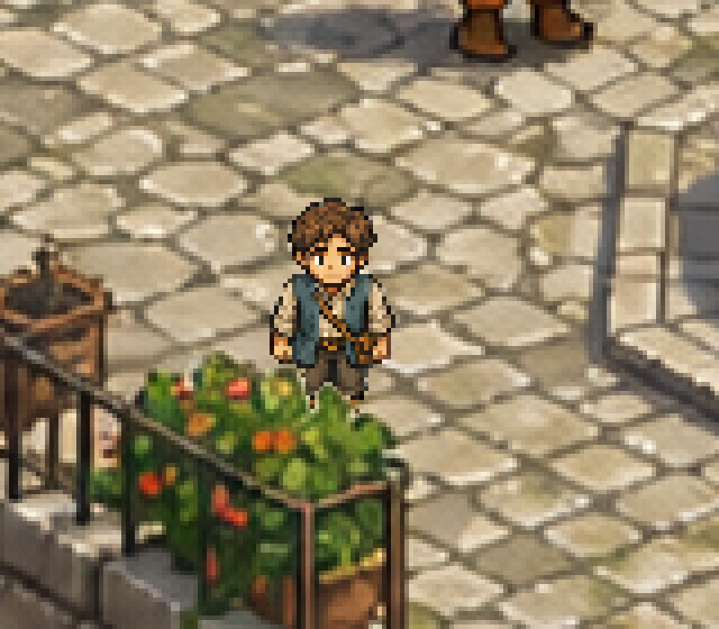
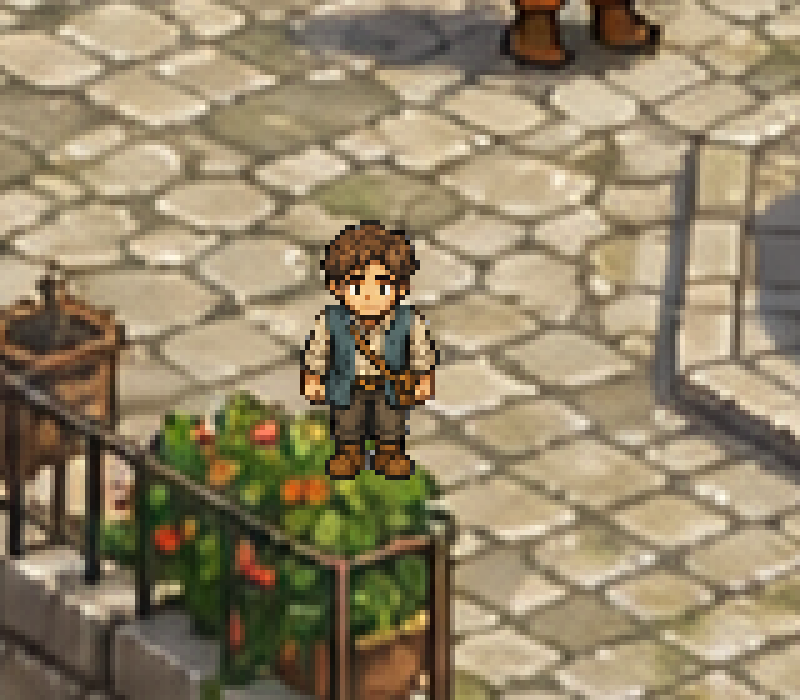

# Experiment E — Animated Traveler and One Local Occluder

## Question

Can the accepted Experiment D playable court gain a readable animated
traveler and one convincing foreground-depth interaction without changing the
walkable geometry or implying that the flattened scene has been generally
decomposed?

## Result scope

Yes, within one deliberately narrow interaction. The red programmer marker is
replaced by a teal-and-cream traveler with twelve frames: three poses for each
of down, left, right, and up. The player can step behind the southwest railing
planter, whose exact source pixels render above the character.

The gameplay geometry is byte-identical to Experiment D. You can still traverse
only the lower west–south–east U-shaped fountain court and return. The northern
market, stairs, east street, lower level, roofs, facades, and other apparent
openings remain blocked scenery.



The causal control deliberately renders the player above the planter:



## Controls and playtest

- Arrow keys or WASD: move.
- `F2`: show the cyan walkable boundary, yellow route, and magenta planter
  test pose.
- `Esc`: quit.

From the spawn, tap left to move toward the magenta pose beside the southwest
planter. In the correct build, its foliage/rail hides the traveler's boots and
lower legs. You can then continue around the same lower court as before.

```powershell
godot --path "D:\Apennino scene\experiment-e-character-occlusion" --scene res://scenes/main.tscn
```

## Reproduce all evidence

Requirements: Godot 4.7.2, Python, and Pillow.

```powershell
powershell -ExecutionPolicy Bypass -File scripts/run_validation.ps1
```

The runner:

1. deterministically rebuilds the atlas and foreground derivatives;
2. validates hashes, alpha, frame layout, mask sparsity, source-pixel equality,
   and unchanged Experiment D geometry;
3. runs twelve Godot assertions;
4. runs seven known-bad mutations, each required to fail for an exact cause;
5. launches a hidden real GL renderer for three fresh native-resolution
   captures and verifies their pixels.

Godot's headless dummy renderer cannot return viewport pixels. Physics and
animation assertions remain headless; only the render-evidence step uses the
hidden real renderer. The failed headless capture route is retained in
`diagnostics/capture_render.log`.

## Character-art provenance

The image generator created a visually useful 3×4 sheet but flattened the
requested transparency into an RGB checkerboard. A targeted alpha-repair edit
failed the same way and changed the canvas height by one pixel. Both untouched
outputs, exact prompts, timestamps, paths, dimensions, and hashes are retained.

The final 144×256 RGBA atlas is a deterministic derivative of the first output:
border-connected checkerboard flood removal, largest-component cleanup per
cell, nearest-neighbor normalization to 48×64 cells, and a common foot
baseline. See `data/art_generation_provenance.json` and
`scripts/prepare_assets.py`.

## Occluder provenance

The foreground is a sparse full-canvas RGBA layer extracted from the locked
scene at identity placement. All 2,072 nontransparent RGB pixels exactly equal
the corresponding source pixels; the separate mask has a reviewed tight
envelope and no broad paving rectangle. At footpoint `(704,675)`, 130 of the
south-idle traveler's 989 opaque pixels overlap the mask.

The real renderer proves:

- correct order: all 130 overlap pixels equal the no-player foreground
  baseline;
- player-above mutation: all 130 become traveler pixels;
- outside the mask: all 859 remaining traveler pixels stay visible in both;
- under the full mask: all 2,072 baseline pixels equal the locked source.

See `data/occlusion_spec.json` and
`diagnostics/render_capture_verification.json`.

## Honest limitations

- Independent visual audit found the traveler readable and distinct but about
  20–30% lower in visual mass than the baked central figures, with darker
  outlines and flatter values. It is an experimental game sprite, not final
  character integration.
- The extracted planter has a thin edge fringe that is invisible at its locked
  integer placement but could halo under scaling, filtering, or subpixel
  movement.
- This is one hand-authored foreground overlap. It is not general Y-sorting,
  automatic semantic extraction, or scene-wide depth.
- Walkability did not expand.

Full results and stumbles are in [RESULTS.md](RESULTS.md); the independent
review is in [diagnostics/visual_audit.md](diagnostics/visual_audit.md).
