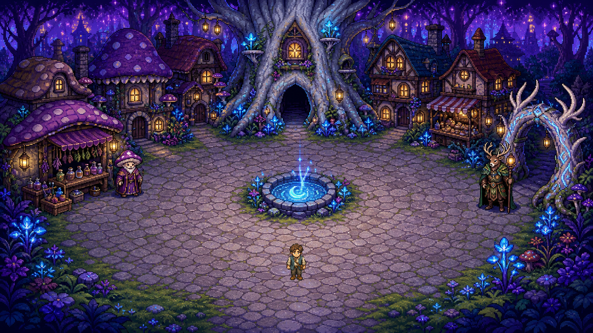

# Moonroot Hollow — Fast Fantastical RPG Prototype

Moonroot Hollow tests whether the Appennino workflow transfers to a new 2D RPG
with no reference-reconstruction constraint and full creative freedom.

## Result

One generated raster town became a complete one-screen quest:

1. walk to Mora, the mushroom apothecary at the left herb stall;
2. press `E` to learn that the root arch needs moonwater;
3. collect moonwater from the central glowing well;
4. deliver it to the antlered gatekeeper on the right;
5. receive a persistent quest-complete state.



The town art succeeded on the first built-in generation call at the exact
1672×941 runtime size. It required no cropping, repainting, resizing, alpha
repair, or other pixel operation. The original and runtime art are
byte-identical.

## Play

```powershell
godot --path "D:\Apennino scene\experiment-g-moonroot-hollow" --scene res://scenes/main.tscn
```

- Arrow keys or WASD: move.
- `E`: interact when prompted.
- `Esc`: quit.

The reused generated traveler is rendered at 2× scale in this town. That is an
explicit response to Experiment F's cross-node scale problem, not a new
procedural image.

## Visible-art constraint

Every visible illustrated asset is a raster PNG. The project contains no SVG,
visible polygon/line/rectangle artwork, procedural draw call, or mathematically
generated placeholder image. Godot collision polygons remain invisible runtime
data; UI consists only of engine-rendered text.

## Validate

```powershell
powershell -ExecutionPolicy Bypass -File scripts/run_validation.ps1
```

The runner verifies the raster-only rule, locked hashes and provenance, seven
runtime checks, four causal mutations, the complete quest route, collision,
and a real-render capture whose no-player pixels exactly equal the generated
town art.

See [RESULTS.md](RESULTS.md) for the Appennino comparison and engine decision.
