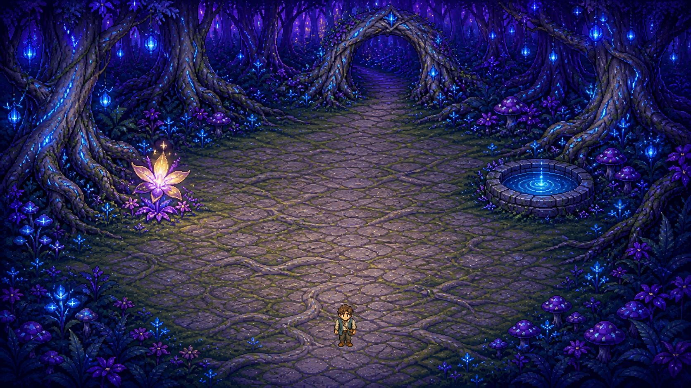
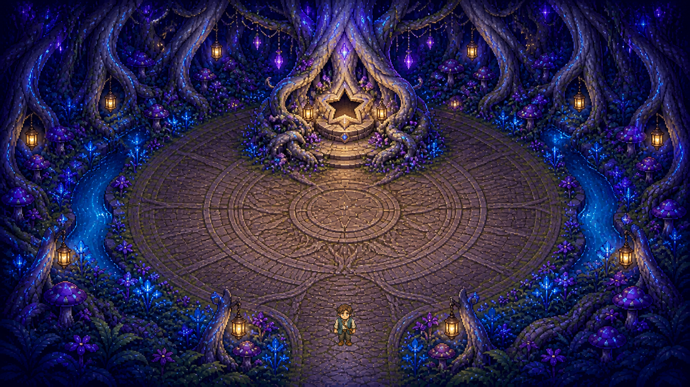

# Moonroot Hollow: The Star-Seed

Experiment H is a compact three-location RPG vertical slice built to test the
furthest useful extension of the raster-first workflow under a time/completeness
objective.

The traveler now crosses a whole small adventure:

1. speak with Mora in Moonroot Hollow;
2. gather moonwater and wake the gatekeeper's root arch;
3. enter Lumenwood Crossing and recover the fallen star-seed;
4. carry it through the forest arch into Heartroot Sanctuary;
5. return it to the altar and reach a real ending.





## Play

```powershell
godot --path "D:\Apennino scene\experiment-h-moonroot-vertical-slice" --scene res://scenes/main.tscn
```

- WASD or arrows: move.
- `E`: interact.
- `F5`: save the current location, quest, inventory, and position.
- `F9`: load; malformed or incompatible saves are rejected.
- `N`: begin a new game without deleting the saved journey.
- `Esc`: quit.

The quest prompt at the upper left always names the next objective. Interaction
text appears at the bottom when the traveler is close enough to a landmark.

## What is new beyond Experiment G

- three connected, stylistically coherent raster locations instead of one;
- an eight-state quest with two inventory items and a visible ending;
- save/load, invalid-save rejection, and new-game reset;
- one generic Godot scene and runtime for every location;
- a declarative world manifest containing art, spawn, boundary, obstacles,
  interaction anchors, and tested routes;
- twelve normal runtime contracts, six causal mutations, and exact real-render
  comparison for all three locations.

The two new environment plates each succeeded on their first built-in image
generation call. They are native 1672×941 RGB PNGs and required zero pixel
operations. Their exact prompts, original tool paths, preserved copies, and
hashes are in [data/art_generation_provenance.json](data/art_generation_provenance.json).

## Visible-art constraint

Every visible illustration is a raster PNG. There are no SVGs, generated
primitive pictures, visible polygon/line/rectangle placeholders, or procedural
draw calls. Godot collision polygons are invisible runtime semantics. The only
engine-rendered visuals are text UI.

## Architecture

All locations are data in
[data/world_manifest.json](data/world_manifest.json). The same
[scripts/world_runtime.gd](scripts/world_runtime.gd) loads a background,
constructs invisible collision, positions the traveler, exposes interactions,
and changes location. Adding the forest and sanctuary did not require a second
or third `.tscn` scene.

This is not a fully generated game compiler: the conservative boundaries,
anchors, route waypoints, quest prose, and state transitions were authored.
The result does establish the right seam for future automation.

## Validate

Requirements: Godot 4.7.2 and Python with Pillow.

```powershell
powershell -ExecutionPolicy Bypass -File scripts/run_validation.ps1
```

The runner performs static/provenance checks, a real physics playthrough,
inventory and persistence tests, six known-bad mutation runs, and six
non-headless OpenGL captures. A baseline from each location must be pixel-equal
to its locked generated art; the traveler must be the only localized change.

See [RESULTS.md](RESULTS.md) for the honest workflow assessment and
[ARCHITECTURE.md](ARCHITECTURE.md) for the reusable pattern.
